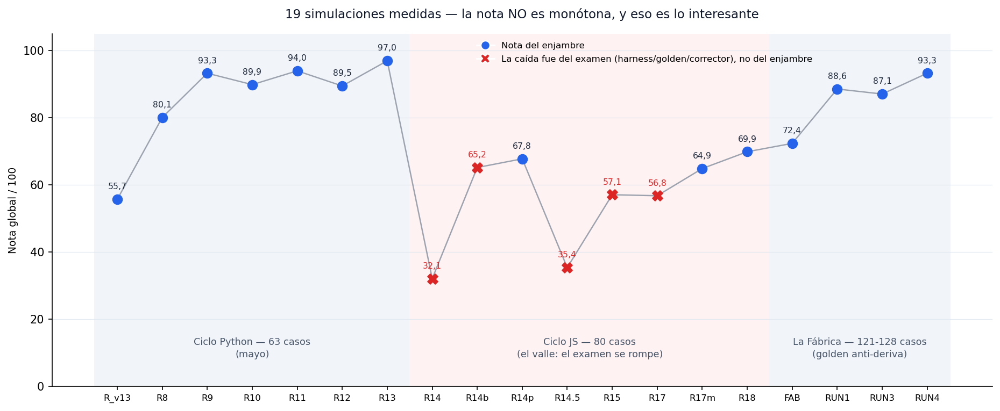

# accounting-agent-swarm

Enjambre de cuatro agentes Claude para automatizar contabilidad real, desarrollado con
evaluación continua: golden set, corrector automático, puertas de no-regresión y
verificador independiente.

→ Página del proyecto: **[jleonceo.github.io/accounting-agent-swarm](https://jleonceo.github.io/accounting-agent-swarm)** (el capítulo de mayo)

[Español](#español) · [English](#english)

---

## Español

### La historia en una imagen



Veintitrés simulaciones medidas entre mayo y julio de 2026, sobre tres exámenes cada vez
más duros. Lo que más me ha enseñado este proyecto no son los récords, son las caídas.

Las tres grandes caídas de la curva (32,1 · 35,4 · 57,1) no las causó el enjambre. Las causó
el examen: un bug del harness que no parseaba la salida del validador, un runner que colapsó
a mitad de ejecución dejando 56 casos sin respuesta, un golden set que se había quedado
desincronizado con la base de datos. El enjambre no empeoró 65 puntos en un día: lo que se
rompió fue el instrumento de medida.

Esa es la lección que me llevo: **cuando evalúas un sistema LLM, el banco de pruebas falla
más a menudo que el sistema**. Si solo miras la última nota, te cuentas una historia equivocada.

### Qué hace el enjambre

**Agente** es aquí el mismo motor de IA con un papel estrecho y unas instrucciones propias, que en la
jerga del proyecto se llaman *skill*. Por dentro el motor es idéntico en los cuatro; cambian el
papel, lo que tiene permitido y lo que se le exige devolver.

Que sean cuatro y no uno tiene una razón: el que juzga no puede ser el que produjo. Pedirle a un
modelo que revise su propio asiento es pedirle que dude del criterio con el que acaba de decidir.

Cuatro agentes especializados, cada uno con su skill:

```
documento (.pdf/.txt) → EXTRACTOR → json → GENERADOR → asiento → VALIDADOR → borrador / revisión
extracto bancario     → PUNTEADOR → conciliación contra MySQL vivo
```

- **extractor-contable**: lee facturas, nóminas y extractos; devuelve JSON estructurado. Si el documento es ilegible, lo dice (no inventa).
- **generador-contable**: del JSON al asiento completo según el PGC 2007, con las cuentas reales de la empresa.
- **validador-contable**: verifica cuadre, integridad y coherencia. Decide si se contabiliza o se frena a revisión manual.
- **punteador-contable**: concilia el extracto bancario contra el diario real en MySQL, línea a línea.

El enjambre **propone, no ejecuta**: los asientos van a una tabla de borradores y los
inserta un humano tras revisarlos. La autonomía es proporcional al riesgo de reversibilidad.

### Cómo se mide

Un **golden set** es una lista de casos con la respuesta correcta escrita de antemano. Sin esa lista
escrita ANTES, la nota la pone quien mira los resultados, y quien mira los resultados ya sabe lo que
esperaba encontrar.

Un corrector automático en Python puntúa cada simulación contra ese golden set, en cinco ejes: acción correcta (¿contabilizar o frenar?), asiento exacto (cuentas
e importes al céntimo), cuadre, calidad del freno (frenar está bien solo si el motivo es el
correcto) y conciliación bancaria (casación contra la base de datos en vivo, no contra un fichero).

La regla que lo gobierna todo: **la simulación se adapta al sistema, nunca el sistema a la
simulación**. Ningún golden, skill o dato se toca para que un test pase.

> **Aviso de convención, porque aquí las dos palabras van al revés de lo corriente.** En los informes
> de `evidencia/`, **falso positivo** es contabilizar un documento que había que frenar, y **falso
> negativo** es frenar uno que estaba bien. El positivo de este corrector es *contabilizar* en vez de
> *dar la alarma*, de donde sale la inversión respecto al uso habitual en detección. Otros repositorios de
> esta misma cuenta, como `pii-output-gate`, siguen la convención de siempre. Se declara en vez de
> corregirse porque cambiar las etiquetas rompería la trazabilidad con las RUN ya cerradas.

### Las tres épocas

**1. El ciclo Python (mayo, 63 casos).** De 55,7 a 97,0 en seis iteraciones. Cada regresión
enseñó algo concreto: una nota demasiado amplia en un prompt afecta a casos que no eran el
objetivo; describir la lógica no basta, hay que decir la acción esperada. Es el capítulo que
cuenta la [landing](https://jleonceo.github.io/accounting-agent-swarm).

**2. El valle (principios de junio, 80 casos).** El examen creció y se rompió varias veces:
fallos en el programa que gobierna el examen, un golden desincronizado con la base de datos, un corrector que marcaba errores donde no los había. Semanas de
arreglar el instrumento de medida más que el sistema medido. Frustrante y, visto con
distancia, la parte más valiosa del proyecto.

**3. La Fábrica (junio, 121-128 casos).** La solución estructural al valle: un generador de
documentos sintéticos donde **el documento, el asiento esperado y el movimiento bancario
nacen de la misma ficha de origen**. El golden ya no puede desincronizarse de los datos porque ambos
son la misma cosa. Con el banco por fin fiable, la nota volvió a medir al enjambre: 72,4 →
88,6 → 87,1 → **93,3**.

### Dónde quedó el cierre de junio (13/06/2026)

| Eje | Resultado |
|---|---|
| Acción correcta (contabilizar vs revisar) | 125/128 = 97,7% |
| Asiento exacto (cuentas + importes) | 81/84 = 96,4% |
| Cuadre de los asientos propuestos | 84/84 = 100% |
| Frenó bien (acción + motivo correcto) | 33/41 = 80,5% |
| Conciliación (casación contra MySQL vivo) | 79/79 = 100% |
| Falsos positivos (asientos erróneos colados) | **0** |

Nota global: **93,3/100**, y la decisión de cerrar ahí. Los cinco casos que quedan abiertos
son casos límite (la opción de compra de un leasing, un asiento de apertura) y variabilidad
del modelo; están documentados caso a caso en [evidencia/](evidencia/), sin maquillar. Un
sexto, la liquidación de IVA como doble asiento, se cerró y verificó el 13/06 en un run
acotado (4/4).
Perseguirlos uno a uno es el bucle de rendimientos decrecientes.

### La parte incómoda: lo que pasó después

Este repo se publicó dando el trabajo por cerrado en 93,3. La curva de arriba llega ahora hasta
julio y termina donde a nadie le gusta enseñar.

| Cuándo | Nota | Qué pasó |
|---|---|---|
| 21 jun | 87,2 | Bajada aparente. El enjambre había mejorado y el examen se quedó viejo: la doctrina partió la cuota de Seguridad Social en dos cuentas y el golden seguía esperándola junta. Quince de los dieciséis fallos de asiento eran eso. |
| 24 jun | 93,2 | Golden sincronizado. Recuperado. |
| 27 jun | **94,2** | Mejor marca. Pipeline completo, con la última milla en simulacro. |
| 20 jul | **79,4** | El examen creció a 129 asientos más 10 extractos. **No es comparable con los anteriores**, y dos de los fallos son del tipo grave: contabilizó documentos que debía haber frenado. |

Tres cosas que aprender de esa tabla, y ninguna es agradable:

**Una nota que baja no siempre significa que el sistema empeore.** La caída del 21 de junio fue
del examen, no del examinado. Diagnosticarlo al revés habría llevado a "arreglar" un enjambre que
funcionaba bien.

**Y una nota que sube tampoco garantiza nada.** El 94,2 se midió sobre un banco más pequeño.
Ampliarlo sacó fallos que estaban ahí desde antes y que ningún examen anterior tocaba.

**La numeración de las corridas no es continua.** Este repo cuenta su historia con etiquetas
propias hasta junio; los puntos posteriores van fechados porque el registro interno del proyecto
usa otra serie, y renumerar hacia atrás lo publicado sería peor que la incomodidad de mezclar dos
formas de etiquetar. Lo que este repo llama la corrida de 93,3 es la que el registro interno
puntúa 93,7: misma corrida, mismo 80,5% de frenó-bien, global repuntuado.

*La muestra del golden que acompaña a este repo (`eval/golden_muestra.json`) se ha regenerado con
la doctrina vigente: la cuota de Seguridad Social va partida en dos cuentas. La versión anterior
la traía junta, que es como se contabilizaba antes del 21 de junio.*

Un detalle del cierre que resume el método: en RUN3, el validador frenó dos asientos
alegando que sus cuentas "no existían". Un primer análisis le creyó y concluyó que faltaba
crear 4 cuentas. Verificado contra MySQL: las 4 existían. El que fallaba era el validador,
que se las inventaba. Desde entonces tiene prohibido afirmar que una cuenta no existe sin
ejecutar la consulta. No fiarse del primer agente; verificar contra la fuente.

### Qué hay en este repo

```
evidencia/
  registro_de_runs.md            ← las 19 simulaciones, una a una, con su causa real
  2026-06-11-RUN1_informe.md     ← informes del corrector, tal cual salieron
  2026-06-12-RUN3_analisis_fallos.md
  2026-06-12-RUN4_informe.md
  2026-06-12-RUN4_cambios_y_tail.md  ← qué se cambió y qué NO se cerró (honesto)
eval/
  eval_enjambre_fabrica.js       ← el runner real (rutas locales saneadas)
  golden_muestra.json            ← 9 casos representativos del golden de 128
assets/curva_runs.png
index.html · styles.css · script.js  ← la landing (capítulo de mayo)
```

Los datos son de TechAcces SL, una empresa **ficticia** creada para este proyecto: ~17.000
líneas de diario en MySQL, cuatro ejercicios (tres cerrados y el vivo), terceros y nóminas sintéticos.
El problema contable es real; el dinero no.

### El capítulo anterior

Este enjambre nació de [llm-eval-contable](https://github.com/jleonceo/llm-eval-contable):
la evaluación de una sola skill contable (50 casos, de 66% a 100% en 6 iteraciones).
Allí está explicado desde cero qué es una skill y por qué hay que examinarla.

### Repos relacionados

Este enjambre es una pieza de un trabajo mayor sobre sistemas con varios agentes. Las piezas hermanas:

- [orquestacion-enjambres-ia](https://github.com/jleonceo/orquestacion-enjambres-ia): el enrutado, cómo se decide a qué agente va cada petición sin romper al crecer.
- [gobernanza-skills-analiticas](https://github.com/jleonceo/gobernanza-skills-analiticas): el método que gobierna a este enjambre, con golden sets y puertas de no-regresión.
- [verificacion-determinista-ia](https://github.com/jleonceo/verificacion-determinista-ia): el guardarraíl que recomprueba la coherencia de los datos sin IA.
- [agent-memory-governance](https://github.com/jleonceo/agent-memory-governance): que la memoria del agente no se convierta en un vertedero.
- [tu-primer-asistente-ia-web](https://github.com/jleonceo/tu-primer-asistente-ia-web): qué es un asistente de IA, para quien empieza de cero.
- [tesoreria-forecast-ia](https://github.com/jleonceo/tesoreria-forecast-ia): previsión de caja por descomposición con backtesting, más ratios y aging.
- [control-interno-fraude-ia](https://github.com/jleonceo/control-interno-fraude-ia): detección de fraude contable con aritmética, dentro de un marco de control interno.

---

## English

A swarm of four Claude agents for automating real accounting, built around continuous
evaluation: a golden set, an automatic grader, no-regression gates and an independent verifier.

→ Project page: **[jleonceo.github.io/accounting-agent-swarm](https://jleonceo.github.io/accounting-agent-swarm)** (the May chapter)

### The story in one picture


Nineteen runs across May and June 2026, against three exams that kept getting
harder. What taught me most here wasn't the high scores. It was the drops.

The three big dips in the curve (32.1, 35.4, 57.1) were not the swarm's doing. The exam caused
them: a harness bug that failed to parse the validator's output, a runner that died halfway
through and left 56 cases unanswered, a golden set that had drifted out of sync with the
database. The swarm did not get 65 points worse overnight. What broke was the measuring
instrument.

That is the lesson I take away: **when you evaluate an LLM system, the test harness fails more
often than the system does**. Look only at the latest score and you will tell yourself the
wrong story.

### What the swarm does

**Agent** here means the same AI engine given a narrow role and its own instructions, called a
*skill* in this project's jargon. The engine is identical in all four; what changes is the role,
what each one is allowed to do and what it must return.

There is a reason for four instead of one: whoever judges cannot be whoever produced. Asking a model
to review its own entry is asking it to doubt the criterion it just applied.

Four specialised agents, one skill each:

```
document (.pdf/.txt) → EXTRACTOR → json → GENERATOR → entry → VALIDATOR → draft / review
bank statement       → RECONCILER → matched against live MySQL
```

- **extractor-contable**: reads invoices, payslips and bank statements, and returns structured JSON. If a document is illegible it says so instead of inventing content.
- **generador-contable**: turns that JSON into a complete journal entry under the Spanish chart of accounts (PGC 2007), using the company's own accounts.
- **validador-contable**: checks that the entry balances, and checks integrity and coherence. It decides whether the entry goes through or gets held for manual review.
- **punteador-contable**: reconciles the bank statement against the live MySQL journal, line by line.

The swarm **proposes; it does not post**: entries land in a drafts table and a person inserts
them after reviewing. Autonomy is proportional to how reversible the action is.

### How it is measured

A **golden set** is a list of cases with the right answer written beforehand. Without that list
written BEFORE, the score is set by whoever reads the results, and whoever reads the results already
knows what they expected to find.

A Python grader scores every run against that golden set, on five axes: the
right call (post it or hold it?), the exact entry (accounts and amounts to the cent), whether
it balances, the quality of the hold (holding is only right if the reason is right too) and
bank reconciliation (matching against the live database, not against a file).

The rule that governs everything else: **the simulation adapts to the system, never the system
to the simulation**. No golden, skill or piece of data gets touched to make a test pass.

### Three eras

**1. The Python cycle (May, 63 cases).** From 55.7 to 97.0 over six iterations. Every
regression taught something specific: a note written too broadly in a prompt reaches cases it
was never aimed at, and describing the logic is not enough: you have to state the expected
action. This is the chapter the [landing page](https://jleonceo.github.io/accounting-agent-swarm) tells.

**2. The valley (early June, 80 cases).** The exam grew and broke several times over: a buggy
harness, a golden out of sync, a grader that introduced false positives. Weeks spent fixing the
measuring instrument rather than the system being measured. Frustrating at the time and, seen
from a distance, the most valuable part of the project.

**3. The Factory (June, 121-128 cases).** The structural fix for the valley: a synthetic
document generator where **the document, the expected entry and the bank movement all come out
of the same manifest**. The golden can no longer drift from the data, because they are the same
thing. With the harness finally trustworthy, the score went back to measuring the swarm: 72.4 →
88.6 → 87.1 → **93.3**.

### Where it stands (closed 13/06/2026)

| Axis | Result |
|---|---|
| Right call (post vs review) | 125/128 = 97.7% |
| Exact entry (accounts + amounts) | 81/84 = 96.4% |
| Proposed entries that balance | 84/84 = 100% |
| Held it for the right reason | 33/41 = 80.5% |
| Reconciliation (matched against live MySQL) | 79/79 = 100% |
| False positives (bad entries slipping through) | **0** |

Overall score: **93.3/100**, and the call to stop there. The five cases still open are edge
cases (the purchase option on a lease, an opening entry) plus model variability, and they are
documented one by one in [evidencia/](evidencia/), with nothing dressed up. A sixth, the VAT
settlement as a double entry, was closed and verified on 13/06 in a narrow run (4/4).
Chasing them one by one is where diminishing returns set in.

One detail from the close sums up the method: in RUN3 the validator held two entries, claiming
their accounts "did not exist". A first analysis believed it and concluded that 4 accounts had
to be created. Checked against MySQL: all 4 were already there. The validator was the one
failing, making them up. Since then it is not allowed to claim an account does not exist
without running the query. Do not take the first agent's word; check against the source.

### What is in this repo

```
evidencia/
  registro_de_runs.md            ← the 19 runs, one by one, with their real cause
  2026-06-11-RUN1_informe.md     ← the grader's reports, exactly as they came out
  2026-06-12-RUN3_analisis_fallos.md
  2026-06-12-RUN4_informe.md
  2026-06-12-RUN4_cambios_y_tail.md  ← what changed and what did NOT get closed (honest)
eval/
  eval_enjambre_fabrica.js       ← the actual runner (local paths sanitised)
  golden_muestra.json            ← 9 representative cases from the golden set of 128
assets/curva_runs.png
index.html · styles.css · script.js  ← the landing page (the May chapter)
```

The data belongs to TechAcces SL, a **fictional** company created for this project: about
17,000 journal lines in MySQL, four financial years (three closed and the live one), synthetic
counterparties and payslips. The accounting problem is real; the money is not.

### The previous chapter

This swarm grew out of [llm-eval-contable](https://github.com/jleonceo/llm-eval-contable): the
evaluation of a single accounting skill (50 cases, from 66% to 100% over 6 iterations). That
repo explains from scratch what a skill is and why it has to be examined.

### Related repositories

This swarm is one piece of a wider body of work on multi-agent systems. Its sibling pieces:

- [orquestacion-enjambres-ia](https://github.com/jleonceo/orquestacion-enjambres-ia): the routing, how a system decides which agent handles each request without breaking as it grows.
- [gobernanza-skills-analiticas](https://github.com/jleonceo/gobernanza-skills-analiticas): the method that governs this swarm, with golden sets and no-regression gates.
- [verificacion-determinista-ia](https://github.com/jleonceo/verificacion-determinista-ia): the guardrail that rechecks the coherence of the data without AI.
- [agent-memory-governance](https://github.com/jleonceo/agent-memory-governance): keeping the agent's memory from turning into a junkyard.
- [tu-primer-asistente-ia-web](https://github.com/jleonceo/tu-primer-asistente-ia-web): what an AI assistant is, for absolute beginners.
- [tesoreria-forecast-ia](https://github.com/jleonceo/tesoreria-forecast-ia): cash-flow forecasting by decomposition with backtesting, plus ratios and aging.
- [control-interno-fraude-ia](https://github.com/jleonceo/control-interno-fraude-ia): accounting fraud detection with arithmetic, inside an internal-control framework.

---

Construido por / Built by [Juan Luis León Rodríguez](https://juanluisleon.vercel.app) · mayo-junio 2026 · Licencia / License: [MIT](LICENSE)
